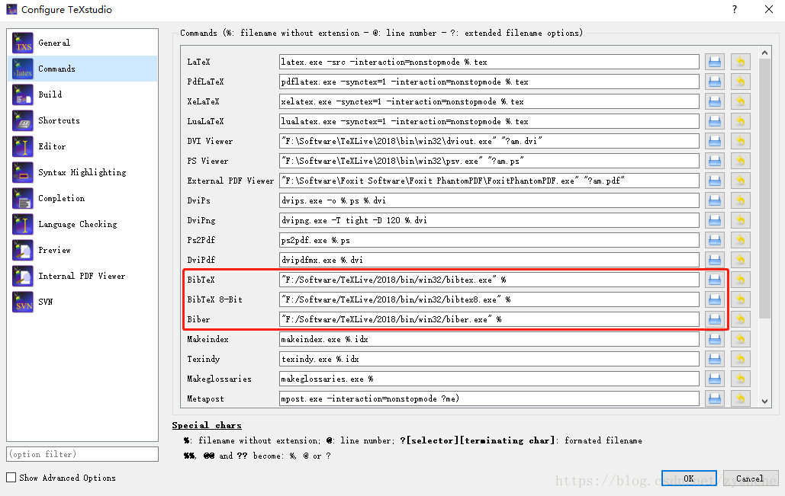
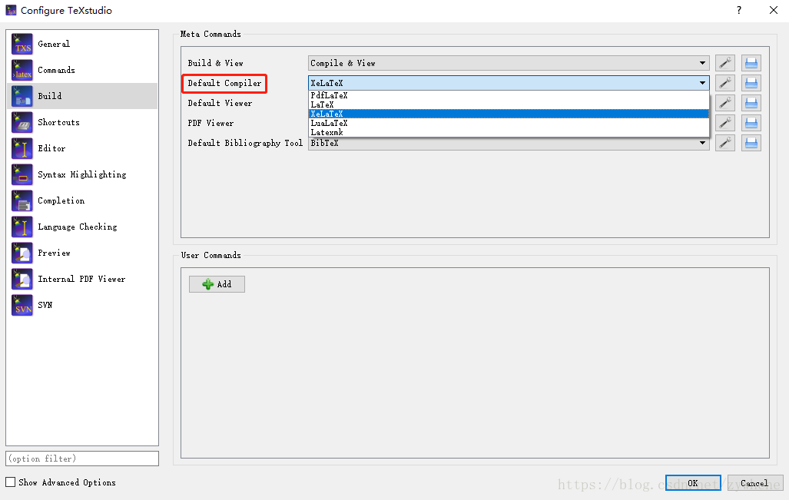

[TOC]

### 1. QQ——文件传输

1. 安装wine
`sudo add-apt-repository ppa:wine/wine-builds   #添加源`
`sudo apt-get update    #更新源`
`sudo apt-get install winehq-devel  #安装wine`
2. 安装QQ
从百度云下载安装包[链接](https://pan.baidu.com/s/1kENXtaEBtxmtBhlC-1g3ZA) 提取码 : *ykcw*
`tar xvf wineQQ8.9_19990.tar.xz -C ~/   #解压至主目录，完成安装`
3. 卸载QQ
`rm -rf ~/.wine`
`rm -rf ~/.local/share/applications/wine-QQ.desktop`
`rm -rf ~/.local/share/icons/hicolor/256x256/apps/QQ.png`
`rm -rf ~/.fonts/simsun.ttc`
4. 参考链接
[ubuntu安装新版QQ](https://www.cnblogs.com/sangewuxie/p/7477261.html)

### 2. WPS——文件编辑

1. 安装WPS
从[官网](http://www.wps.cn/product/wpslinux/)下载安装包，解压安装。
`sudo dpkg -i wps-office_10.1.0.5672~a21_amd64.deb  #版本要对应`
2. 字体缺失问题
下载[字体库](http://vdisk.weibo.com/s/ajLw30suHpSUg?from=page_100505_profile&wvr=6)。
`sudo mkdir /usr/share/fonts/wps-office #创建文件夹`
`sudo cp -r wps_symbol_fonts.zip /usr/share/fonts/wps-office    #移入字体库`
`sudo unzip wps_symbol_fonts.zip    #解压至当前文件夹`
3. 参考链接
[Ubuntu16.04 安装WPS（亲测）](https://blog.csdn.net/superrunner_wujin/article/details/78158165)

### 3. XMind——思维导图

1. 安装XMind
从[官网](https://www.xmind.net/download/zen)下载安装包（.deb类型），双击安装。

### 4. ClamAV——杀毒软件

1. 安装ClamAV
`sudo apt-get update    #更新源`
`sudo apt-get install clamav    #安装`
`sudo apt-get install libclamunrar6 #可扫描.RAR压缩文件`
`sudo freshclam #更新病毒库`
2. 扫描病毒
`sudo clamscan -r /home #home目录`
`sudo clamscan -r --bell -i /   #全盘扫描，只输出被感染的文件`
3. 安装图形界面
`sudo apt-get install ClamTK    #可设置扫描计划等`
4. 参考链接
[Ubuntu安装使用ClamAV(杀毒软件)](http://blog.topspeedsnail.com/archives/4300)

### 5. 有道词典——划词翻译

1. 安装有道 
从[官网](http://cidian.youdao.com/index-linux.html)下载安装包（.deb类型），双击安装。

### 6. 网易云音乐——音乐播放器

1. 安装网易云音乐
从[官网](https://music.163.com/#/download)下载安装包（.deb类型），双击安装。

### 7. TeamViewer——远程控制

1. 安装TeamViewer
从[官网](https://www.teamviewer.com/cn/download/linux/)下载安装包（.deb类型）。
`sudo apt-get install libjpeg62:i386 libxinerama1:i386 libxrandr2:i386 libxtst6:i386 ca-certificates    #安装依赖`
`sudo dpkg -i teamviewer_13.1.3026_amd64.deb    #版本要对应`
`sudo apt -f install    #修复依赖`
2. 参考链接 
[UBUNTU16.04下Teamviewer的安装](https://blog.csdn.net/weixin_41887832/article/details/79832991)

### 8. 蓝灯Lantern——科学上网

1. 安装Lantern
从github[项目主页](https://github.com/getlantern)下载安装包（.deb类型），双击安装。

### 9. 谷歌Chrome——浏览器

1. 安装Chrome 
从[官网](https://www.google.cn/chrome/index.html)下载安装包（.deb类型）。
`sudo apt install libappindicator1 libindicator7    #安装依赖`
`sudo dpkg -i google-chrome-stable_current_amd.deb  #版本要对应`
`sudo apt -f install    #修复依赖`
2. 参考链接
[Ubuntu16.04安装谷歌浏览器](https://blog.csdn.net/Muleung/article/details/80623533)

### 10. LaTeX——基于ΤΕΧ的排版系统

>LaTeX是一种高效的排版系统，普遍用于书籍、科技文档等的写作，它的内容和样式完全分离，排版过程是**源文件→编译→生成PDF**，相比Word，主要的优势有：高效整洁的数学环境、更清晰的文档结构。

1. 安装TexLive（编译器）
从清华镜像下载安装包（2018版），或者网盘下载（2015版）
[清华镜像](https://mirrors.tuna.tsinghua.edu.cn/CTAN/systems/texlive/tlnet/)    [百度云](https://pan.baidu.com/s/120xZjoFR1dcBKK6jf2L-SQ)   提取码：kyiz
`sudo apt-get install perl-tk perl-doc  #安装依赖`
`tar -xzf install-tl-unx.tar.gz #解压`
`cd install-tl-2018*`
`sudo ./install-tl  #终端安装`
`sudo ./install-tl -gui  #通过图形界面安装`
2. 配置环境变量
要注意路径名一定要与自己的版本相对应。
`export PATH=/usr/local/texlive/2018/bin/x86_64-linux:$PATH`
`export MANPATH=/usr/local/texlive/2018/texmf-dist/doc/man:$MANPATH`
`export INFOPATH=/usr/local/texlive/2018/texmf-dist/doc/info:$INFOPATH`
`sudo visudo`
将*secure_path*修改为：*secure_path="/usr/local/texlive/2018/bin/x86_64-linux:/usr/local/sbin:/usr/local/bin:/usr/sbin:/usr/bin:/sbin:/bin:/snap/bin"*
3. 字体设置
报错：*fontspec error: "Times New Roman" cannot be found.*
解决：`sudo apt-get install msttcorefonts   #安装CoreFonts字库`
报错：*fontspec error: "KaiTi" cannot be found.*
解决：从win7的*c:\windows\fonts*中拷贝**KaiTi**至ubuntu的目录/usr/share/fonts，然后在终端执行如下命令：
`sudo mkfontscale`
`sudo mkfontdir`
`sudo fc-cache -fv`
终端显示*fc-cache: succeeded*，表示字体库已经安装好。
4. 安装TeXstudio（编辑器）
`sudo add-apt-repository ppa:sunderme/texstudio #添加PPA`
`sudo apt-get update`
`sudo apt-get install texstudio`
5. 配置TeXstudio（编辑器）
主要对其**Commands**和**Build**部分进行配置。
**Commands**配置：*Options→Configure TeXstudio→Commands*，将BibTeX、BibTeX 8-Bit、Biber的路径设置为TeXlive安装路径下对应EXE文件。

**Build**配置：*Options→Configure TeXstudio→Build*，将Default Compiler修改为XeLaTeX（默认编译器），将Default Bibliography Tool设置为BibTeX（默认参考文献工具，应该是和命令设置中的EXE对应）。

6. 参考链接
[LaTeX介绍](https://zhuanlan.zhihu.com/p/32058882)
[ubuntu下安装TexLive](http://www.levizebulon.cn/2019/01/03/ubuntu%E4%B8%8B%E5%AE%89%E8%A3%85TexLive/)
[Ubuntu安装中文字体](http://www.cnblogs.com/windfall/p/4982584.html)
[如何在Ubuntu 18.04/17.10/16.04中安装TeXstudio 2.12.8](https://www.linuxidc.com/Linux/2018-04/151691.htm)
[LaTeX新手入门以及TeXlive和TeXstudio的安装使用](https://blog.csdn.net/zywhehe/article/details/83113214#%E4%B8%80%E3%80%81%E5%91%BD%E4%BB%A4%E5%92%8C%E6%9E%84%E5%BB%BA%E8%AE%BE%E7%BD%AE)
[iNSFC - 2017 年国家自然基金 LaTeX 模板](https://github.com/YimianDai/iNSFC)

### 11. JabRef——参考文献生成

1. 安装JabRef
从**Ubuntu软件**中搜索即可安装。

### 12. Mathpix——公式提取

1. 安装Mathpix
从**Ubuntu软件**中搜索即可安装。

### 13. Mendeley——论文管理

1. 安装Mendeley  
从[官网](https://www.mendeley.com/download-desktop/)下载安装包（.deb类型），双击安装。

### 14. PyCharm——Python IDE

1. 安装PyCharm
从**Ubuntu软件**中搜索即可安装。

### 15. Visual Studio Code——文本（代码）编辑器

1. 安装Visual Studio Code
从[官网](https://code.visualstudio.com/)下载安装包（.deb类型），双击安装。
