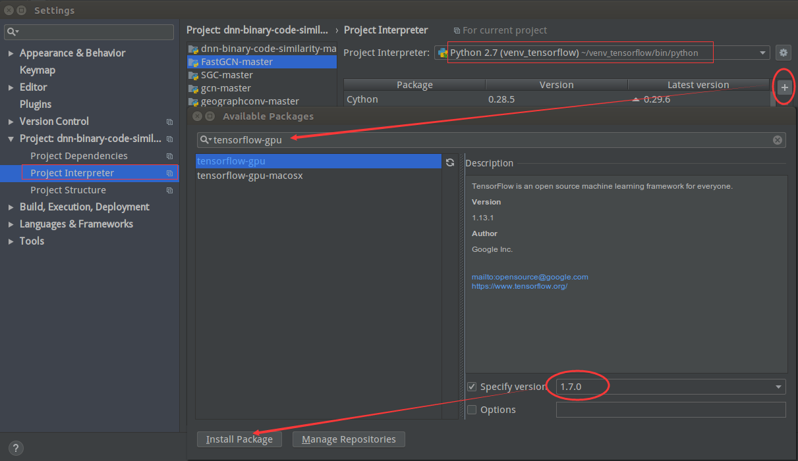

[TOC]

### 1. DL环境配置

为了使用现有的基于GPU的深度学习框架，需要提前安装相关的依赖，这里主要列举一些重要依赖的安装过程和注意事项，一些更为基础的依赖则可以简单的使用pip或者PyCharm中的安装包管理处进行安装，例如：NumPy、SciPy等。使用PyCharm安装即在设置中选择项目解释器，点击“+”来添加需要的Python包。  
注：如果打开了多个工程项目，每个都要选择对应的Python环境，默认是Python 2.7或Python 3.5，当然也可以为项目建立新的Python环境，所以通过“+”安装的资源会独立存在本项目对应的Python环境中。  
  

#### 1.1 NVIDIA驱动

1. 获取驱动  
`lspci -vnn | grep VGA  #获取显卡型号，我的是GTX 1070`  
在[官网](https://www.nvidia.com/Download/index.aspx)下载支持GTX 1070显卡的最新驱动（.run类型）。  
2. 卸载原有N卡驱动（首次安装即可跳过）  
`sudo apt-get remove --purge nvidia*`  
`sudo chmod +x *.run    #原来版本的.run文件`  
`sudo ./NVIDIA-Linux-x86_64-384.59.run --uninstall`  
3. 禁用nouveau驱动  
`sudo gedit /etc/modprobe.d/blacklist.conf  #打开文件`  
在文末添加：  
*blacklist nouveau*  
*options nouveau modeset=0*  
`sudo update-initramfs -u`  
重启后执行`lsmod | grep nouveau`若没有输出，表示禁用成功。  
4. 禁用X-Window服务  
`sudo service lightdm stop #这会关闭图形界面，但不用紧张`  
    >按Ctrl-Alt+F1进入命令行界面，输入用户名和密码登录即可。  
在命令行输入：`sudo service lightdm start`，然后按Ctrl-Alt+F7即可恢复到图形界面。  
5. 安装驱动  
`sudo chmod +x NVIDIA-Linux-x86_64-390.77.run   #给文件件赋予执行权限`  
`sudo ./NVIDIA-Linux-x86_64-390.77.run -no-x-check -no-nouveau-check -no-opengl-files   #参数非常重要，不可省略`  
    >*-no-x-check*：表示安装驱动时不检查X服务，非必需。  
*–no-nouveau-check*：表示安装驱动时不检查nouveau，非必需。  
*–no-opengl-files*：表示只安装驱动文件，不安装OpenGL文件。这个参数不可省略，否则会导致登陆界面死循环，英语一般称为”login loop”或者”stuck in login”。  
6. 测试  
`nvidia-smi #若列出GPU的信息列表，表示驱动安装成功`  
      
7. 参考链接  
[Ubuntu下安装nvidia显卡驱动（安装方式简单）](https://blog.csdn.net/linhai1028/article/details/79445722)  
[Ubuntu 16.04安装NVIDIA驱动](https://blog.csdn.net/cosmoshua/article/details/76644029)  

#### 1.2 CDUA

1. 获取驱动  
由`nvidia-smi`结果可知，我的显卡Driver Version: 390.77，从[官网](https://docs.nvidia.com/cuda/cuda-toolkit-release-notes/index.html)查找CUDA Driver对应表，安装CUDA 8.0和CUDA 9.0应该就可以满足上层框架的全部需求。  
      
从[官网](https://developer.nvidia.com/cuda-toolkit-archive)下载CUDA 8.0和CUDA 9.0安装包（.run类型）。  
2. 安装驱动  
`sudo apt-get install freeglut3-dev build-essential libx11-dev libxmu-dev libxi-dev libgl1-mesa-glx libglu1-mesa libglu1-mesa-dev   #安装相关依赖`  
`sudo sh cuda_8.0.61_375.26_linux.run #开始安装`  
终端信息：  
    >accept/decline/quit: accept  #接受协议  
Install NVIDIA Accelerated Graphics Driver for Linux-x86_64 375.26?  
y)es/(n)o/(q)uit: n #是否显卡驱动包，第一个版本安装选y，第二个版本安装选n  
Install the CUDA 8.0 Toolkit?  
(y)es/(n)o/(q)uit: y #是否安装工具包，选择y  
Enter Toolkit Location  
[ default is /usr/local/cuda-8.0 ]: #工具包安装地址，默认回车即可  
Do you want to install a symbolic link at /usr/local/cuda?  
(y)es/(n)o/(q)uit: y #添加链接  
注：如果你之前安装过另一个版本的cuda，除非你确定想要用这个新版本的cuda，否则这里就建议选no，因为指定该链接后会将cuda指向这个新的版本  
Install the CUDA 8.0 Samples?  
(y)es/(n)o/(q)uit: y #安装样例  
Enter CUDA Samples Location  
[ default is /root ]:  #样例安装地址默认即可  
3. 配置环境变量  
`gedit ~/.bashrc    #修改配置文件`  
在文末添加：  
*export LD_LIBRARY_PATH=\$LD_LIBRARY_PATH:/usr/local/cuda/lib64*  
*export PATH=\$PATH:/usr/local/cuda/bin*  
*export CUDA_HOME=\$CUDA_HOME:/usr/local/cuda*  
`source ~/.bashrc   #使之生效`  
4. 测试  
`nvcc -V    #显示CUDA信息即安装成功`  
5. 多版本CUDA切换  
修改*/usr/local/cuda*这个软链接的指向，指向哪个版本便会使用哪个版本。  
`sudo rm -rf /usr/local/cuda   #删除原来的软链接`  
`sudo ln -s /usr/local/cuda-9.0 /usr/local/cuda #创建新的软链接指向CUDA 9.0`  
`sudo stat /usr/local/cuda #查看软链接指向`  
      
6. 参考链接  
[在ubuntu上安装多个版本的CUDA，并且可以随时切换](https://blog.csdn.net/ksws0292756/article/details/80120561)  

#### 1.3 cuDNN

1. 获取安装包  
去[官网](https://developer.nvidia.com/rdp/cudnn-download)下载对应的安装包(.tgz格式)。我搭配的两个版本分别是：*cudnn-8.0-linux-x64-v5.0-ga.tgz*和*cudnn-9.0-linux-x64-v7.3.0.29.tgz*。  
2. 安装  
`tar -xvf cudnn-8.0-linux-x64-v5.0-ga.tgz  #解压`  
将对应的文件移入CUDA文件夹内  
`sudo cp cuda/include/cudnn.h /usr/local/cuda/include/`  
`sudo cp cuda/lib64/libcudnn* /usr/local/cuda/lib64/`  
`sudo chmod a+r /usr/local/cuda/include/cudnn.h`  
`sudo chmod a+r /usr/local/cuda/lib64/libcudnn*`  
3. 多版本CUDA问题  
**注**：由于在切换CUDA版本时，会将/usr/local/cuda/删除并重新生成，cuDNN便会随着旧版本一同删除，因此，在多个CUDA版本的情况下，稳妥的做法是将对应的cuDNN文件移入/usr/local目录下的cuda-8.0和cuda-9.0中。这样做便保证了在切换CUDA版本时，cuDNN依旧有效。  

### 2. Theano-gpu安装

1. 官网了解  
先确定需要的Theano-gpu版本，再从[官网](http://www.deeplearning.net/software/theano/install_ubuntu.html)查看安装该版本Theano所需的外部依赖，依次安装所有的外部依赖。libgpuarray的安装比较复杂，单独加以说明。  
`git clone https://github.com/Theano/libgpuarray.git    #若没有git工具，直接下载也行`  
`cd libgpuarray`  
`mkdir Build`  
`cd Build`  
`make`  
`make install`  
`python setup.py build  #在libgpuarray文件夹中`  
`python setup.py install    #在libgpuarray文件夹中`  
`sudo ldconfig`  

2. 安装Theano  
`sudo pip install theano==0.8.2 #==后面是指定的版本号`  
`sudo gedit .theanorc`  
在文末添加  
    >[global]  
floatX=float32  
device=gpu  
base_compiledir=~/external/.theano/  
allow_gc=False  
warn_float64=warn  
[mode]=FAST_RUN  
[nvcc]  
fastmath=True  
[cuda]  
root=/usr/local/cuda  

3. 测试  
`python`  
`import theano   #没有报错即为安装成功`  

4. CNMeM报错  
报错：*Theano: CNMeM is disabled, CuDNN not available*  
解决：  
`sudo gedit .theanorc`  
在文末添加  
    >[lib]  
cnmem=0.8  

      

5. 参考链接  
[libgpuarray Installation](http://deeplearning.net/software/libgpuarray/installation.html)  
[Theano: CNMeM is disabled, CuDNN not available](https://blog.csdn.net/JohinieLi/article/details/77100240)  
[Ubuntu 16.04下CUDA8.0+Theano+Caffe+TensorFlow环境搭建](https://www.linuxidc.com/Linux/2016-09/135528.htm)  

### 3. TensorFlow-gpu安装

1. 官网了解  
从[官网](https://www.tensorflow.org/install/gpu)查看需要的软硬件要求，安装需要的依赖。  
      

2. 安装TensorFlow  
使用PyCharm创建一个新的运行环境*venv_tensorflow*，放在默认路径/home/wtl下，用PyCharm的包资源管理器选择**tensorflow-gpu==1.7.0**进行安装，详情如下图，或者在新的环境下使用pip安装，指令如下：  
`pip install tensorflow-gpu==1.7.0  #安装`  

      

3. 参考链接  
[TensorFlow官网](https://www.tensorflow.org/install)  

### 4. PyTorch-gpu安装

1. 官网了解  
从[官网](https://pytorch.org/get-started/locally/)选择适合的版本，发现pip指令仅需要安装两个包即可，于是果断使用PyCharm来安装。  
      

2. 安装PyTorch  
使用PyCharm创建一个新的运行环境*venv_pytorch*，放在默认路径/home/wtl下，用PyCharm的包资源管理器选择**torch==1.0.0**、**torchvision==0.2.2**进行安装，安装详情如下图：  
      

3. 参考链接  
[PyTorch官网](https://pytorch.org/get-started/locally/)  
